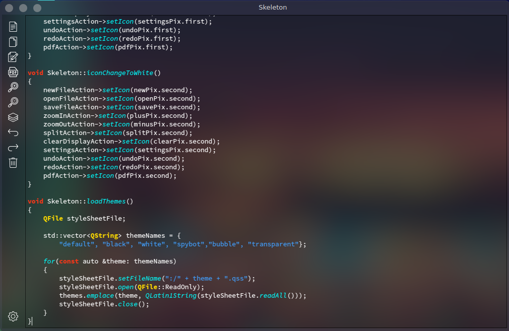
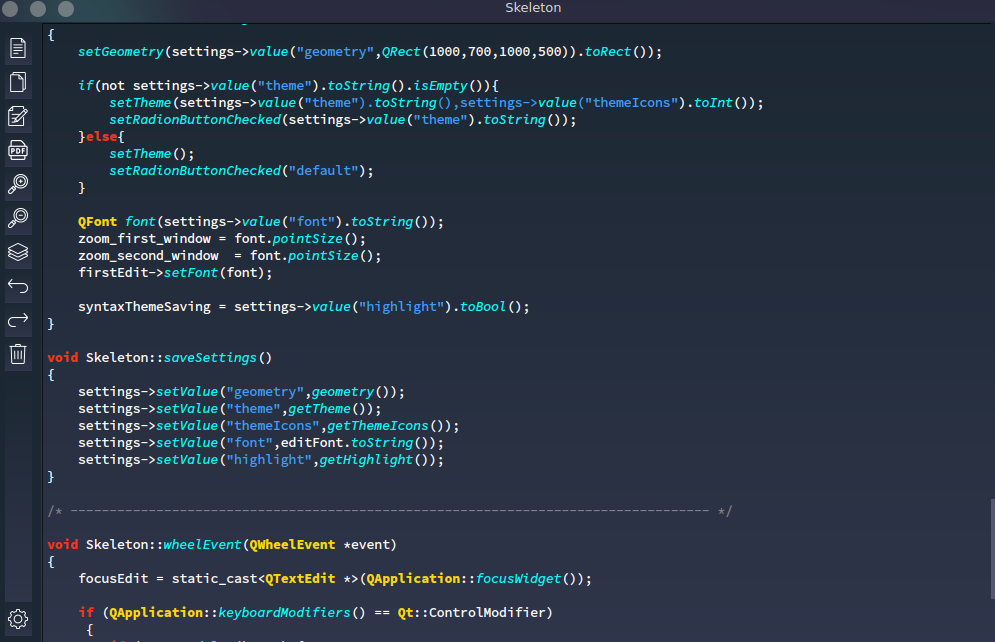

# Skeleton opensource text editor

## Themes
- Transparent

- SpyBot

- Two variantes of cxx syntax
- Font changing
- PDF writer

## Dependence

For using this text editor you must have Qt 5.15.2 on your PC.
I working about rpm and deb packages, but now we have only binary
file that work on Fedora Linux without any dependence. 
In next release I'll push editor on Snap store and next in rpm/deb.

### Deploying :

  cmake --build path/to/build --config Release --target all
  
    make
  
    ./Skeleton